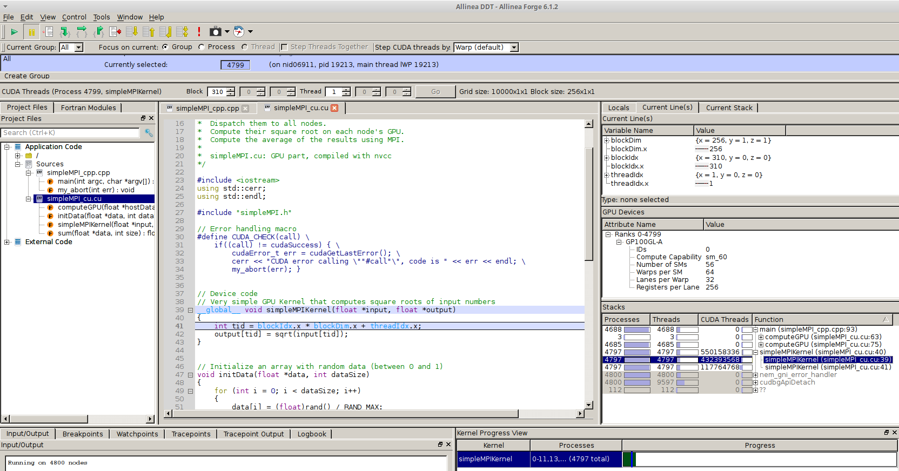

# Debugging Tools

## DDT

[Allinea DDT](https://www.allinea.com/products/ddt) provides source-level
debugging of Fortran, C, and C++ codes.

It can be used for debugging serial, multi-threaded (OpenMP), multi-process
(MPI) and accelerator based (Cuda, OpenACC) programs running on research and
production systems, including the CRAY Piz Daint system. It can be executed
either as a graphical user interface (ddt --connect mode) or from the
command-line (ddt --offline mode).

### Using DDT

DDT is available on all CSCS (Cray and non Cray) systems. In order to check and
use the debugger, type the following commands:

> module avail ddt  
> module load ddt  
> ddt &

CSCS license enables large scale debugging (up to >6000 compute nodes/gpus on
PizDaint).  For source level debugging, the program must be compiled with the
`-g` (for cpu) and `-G` (for nvcc) debugging flags.  You can then launch ddt
directly from the login node or submit your debugging job via a slurm jobscript
using the `ddt --connect srun` command.

Note that the -p debug partition can be used for debugging. If larger or longer
debugging sessions are needed, please contact us.  

### Further information and troubleshooting

For more details, please have a look at:

* [http://www.allinea.com/user-guide](http://www.allinea.com/user-guide)
* [Allinea's Youtube channel](http://www.youtube.com/user/AllineaSoftware/videos)
* CSCS webinars: [videos](https://www.youtube.com/playlist?list=PL1tk5lGm7zvR1CPR9KYZZEyRlCYQYY-Xp) and [src codes](ftp://ftp.cscs.ch/out/jgp/allinea/2016-allinea-cscs-codes.tgz)

In case of questions/remarks, please contact us at [help@cscs.ch](mailto:help@cscs.ch)

